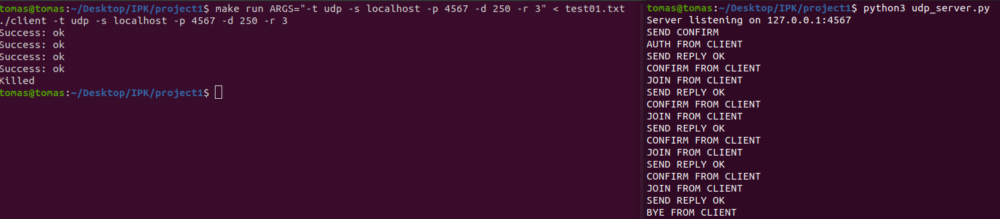

# Klient pro chatovací server
## Shrnutí
TCP a UDP klient pro chatovací server využívající IPK24-chat protokol. 
## Implementace
### Vývoj
- Program byl vytvářen a testován v prostředí linux na operačním systému Ubuntu 64-bit. 
  
- Byl použit jazyk c s překladačem gcc viz. make file.  
### Spuštění
#### Argumenty
- `-t <tcp/udp>`&nbsp;&nbsp;&nbsp;&nbsp;&nbsp;&nbsp;&nbsp;&nbsp;&nbsp;&nbsp;&nbsp;&nbsp;&nbsp;&nbsp;&nbsp;&nbsp;&nbsp;&nbsp;&nbsp;&nbsp;: tcp nebo udp klient(povinný).  
- `-s <server_address>`&nbsp;&nbsp;&nbsp;&nbsp;&nbsp;&nbsp;&nbsp;&nbsp;: adresa serveru(povinný).   
- `[-p <server_port>]`&nbsp;&nbsp;&nbsp;&nbsp;&nbsp;&nbsp;&nbsp;&nbsp;&nbsp;&nbsp;: číslo portu(volitelný - implicitně 4567).  
- `[-d <timeout>]`&nbsp;&nbsp;&nbsp;&nbsp;&nbsp;&nbsp;&nbsp;&nbsp;&nbsp;&nbsp;&nbsp;&nbsp;&nbsp;&nbsp;&nbsp;&nbsp;&nbsp;: pro udp, doba čekání na confirm zprávu ze serveru(volitelný - implicitně 250ms).  
- `[-r <retransmissions>]`&nbsp;&nbsp;&nbsp;: pro udp, počet opětovných zaslání zprávy, na kterou se očekává zpráva confirm(volitelný - implicitně 3).  
- `[-h]`&nbsp;&nbsp;&nbsp;&nbsp;&nbsp;&nbsp;&nbsp;&nbsp;&nbsp;&nbsp;&nbsp;&nbsp;&nbsp;&nbsp;&nbsp;&nbsp;&nbsp;&nbsp;&nbsp;&nbsp;&nbsp;&nbsp;&nbsp;&nbsp;&nbsp;&nbsp;&nbsp;&nbsp;&nbsp;&nbsp;&nbsp;&nbsp;&nbsp;&nbsp;: vypíše nápovědu v podobě přehledu argumentů(volitelný).  
#### Spuštění
- Kompilace proběhne příkazem: `make`  
- Program lze spustit pomocí přiloženého make souboru pomocí příkazu: `make run ARGS="<arguments>"` 
- Jinak lze spustit pomocí `./client <arguments>`
##### Příklady spuštění
- `make run ARGS="-h"` 
- `make run ARGS="-t tcp -s localhost"` 
- `make run ARGS="-t udp -s localhost -p 4567 -d 250 -r 3"` 
- `./client -t udp -s localhost`  

### UDP
#### Moduly
##### `udp.c`
- Řídí celou udp komunikaci a volá funkce z modulu `udp_functions.c`. 
##### `udp.h`
- Definuje rozhraní pro `udp.c`. 
##### `udp_functions.c`
- Implementuje funkce pro načítání a vytváření zprávy, dekódování zprávy a výpis nápovědy k podporovaným příkazům.   
##### `udp_functions.h`
- Definuje rozhraní pro `udp_functions.c`. 
#### Funkčnost
##### Příklad úspěšné udp komunikace klienta a serveru
  
- Klient se nejdříve pokusí o autentizaci - neúspěšně, proto se musí autentizovat znovu, bez úspěšné autentizace program klienta neumožní zasílání jiných zpráv. Klient ukončuje komunikaci příkazem BYE. 
##### Příklad nezaslání CONFIRM zprávy ze serveru
  
- Klient se zašle zprávu a očekává CONFIRM zprávu od serveru, které ale nepříchází. Proto každou periodu, danou argumentem `timeout`, opětovně zašle zprávu. Toto opakuje počtem daným argumentem `retransmissions`(zde se `retransmissions` = 2). Při neúspěchu pošle zprávu BYE a ukončí komunikaci.  
##### Příklad chyby na straně klienta a ukončení komunikace
  
- Klient na vstupu obdrží nepodporované znaky, tudíž dojde k chybě a klient pošle ERROR zprávu serveru a ukončí komunikaci pomocí zprávy BYE.  
### TCP
#### Moduly
##### `tcp.c`
- Řídí celou tcp komunikaci a volá funkce z modulu `tcp_functions.c`. 
##### `tcp.h`
- Definuje rozhraní pro `tcp.c`. 
##### `tcp_functions.c`
- Implementuje funkce pro načítání a vytváření zprávy, dekódování zprávy a výpis nápovědy k podporovaným příkazům.   
##### `tcp_functions.h`
- Definuje rozhraní pro `tcp_functions.c`. 
#### Funkčnost
- Příklady komunikace jsou stejné jako u UDP až na zprávu CONFIRM, která v TCP není. 
## Testování
Testováno na stejné platformě jako pro vývoj a na referenčním serveru.
### UDP
#### Jednoduchá komunikace se serverem
  
Klient posílá autentizaci, požadavek join a 3 zprávy a server odpovídá zprávami CONFIRM a REPLY a k tomu posílá jednoduché zprávy. 
Soubor obsahující zprávy pro server: 
/auth x user x 
/join x 
hello 
how are you? 
bye 
#### Špatný vstup
  
Vstup pro klienta obsahuje nepodporované znaky, zde konkrétně u zprávy. Program vypíše chybovou hlášku na standartní chybový výstup. 
Soubor obsahující zprávy pro server: 
/auth x user x 
/join x 
hello 
my password is ©€日 
bye 
#### Chybějící CONFIRM
  
Klient při odeslané zprávě čeká na zprávu CONFIRM od serveru. Při neobržení po stanovené době zprávu znovu odešle a to tolikrát, kolikrát je stanoveno argumenty programu. Zde se klient zprávy CONFIRM nedočká a proto ukončuje komunikaci. 
#### Vynechání CONFIRM
  
Zde je server nastaven, aby posílal každý druhý confirm, proto klient musí zasílat zprávy vícekrát. 
#### Nepodporovaná zpráva ze serveru
  
Klient obdrží nepodporovaný typ zprávy ze serveru, proto zašle serveru zprávy ERROR a BYE a ukončuje komunikaci.    
### TCP
#### Jednoduchá komunikace se serverem
  
Klient posílá autentizaci, požadavek join a 3 zprávy a server odpovídá zprávami REPLY a k tomu posílá jednoduché zprávy. 
Soubor je stejný jako u UDP. 
#### Špatný vstup
  
Vstup pro klienta obsahuje nepodporované znaky, zde konkrétně u zprávy. Program vypíše chybovou hlášku na standartní chybový výstup. 
#### Nepodporovaná zpráva ze serveru
  
Klient obdrží nepodporovaný typ zprávy ze serveru, proto zašle serveru zprávy ERROR a BYE a ukončuje komunikaci.  
## Omezení
- UDP při chybovém stavu posílá zprávu ERROR a po ní zprávu BYE, ale nečeká na zprávu CONFIRM.  